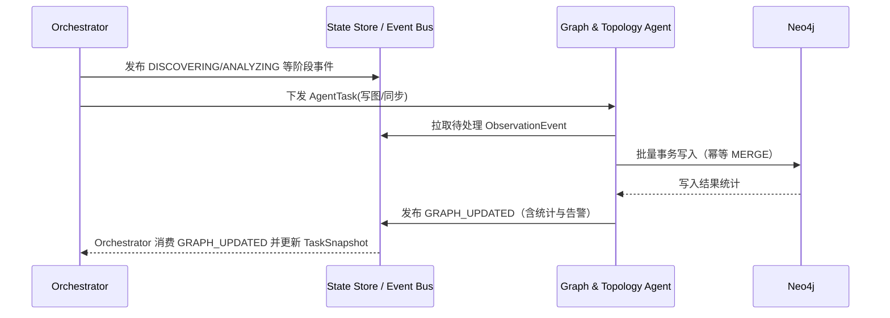

# 一、模块定位与任务描述

图谱聚合模块（Graph & Topology Agent）的目标：在一期“**一个 Flask 后端 + 后端内部多 Agent Runtime + 统一数据面**”架构中，作为 **Neo4j 的唯一写入入口**，把上游 Agent 以 `ObservationEvent + payload_ref + EvidenceRef` 形式沉淀的事实，统一建模为可查询、可回放、可审计的知识图谱（企业关系图 + 资产拓扑图）。

- 范式：**PLAN**（确定性写入流程）
- 技术栈：**Python + Neo4j**
- 聚合后职责：**统一事实底座 / 图谱与拓扑写入**
- 在聚合后端中的位置：`Specialist Agent`

## 1.1 模块边界（必须写死）

| 本模块职责 | 非本模块职责 |
| :--- | :--- |
| 消费事件流（Event Bus / State Store）中的 `ObservationEvent` 并幂等写入 Neo4j | 主动发起扫描、探测、漏洞验证 |
| 统一实体/资产/关系建模与去重（稳定 ID + `MERGE`） | 图谱查询与前端 API（由 `GraphQueryService` 负责） |
| 证据链绑定：将每个节点/边与 `EvidenceRef` 关联 | 价值评估、报告生成、链路推断 |
| 冲突检测与记录（不裁决） | 冲突裁决（交给 `Review Agent` 或人工） |
| 支持事件重放后的全量重建（Replay） | 维护任务状态机推进（由 Orchestrator 负责） |

## 1.2 核心约束（一期强约束）

1. **唯一写入入口**：任何对 Neo4j 的写入必须经过本模块；禁止其他 Agent 直连图数据库。
2. **幂等性**：节点与关系必须基于稳定唯一键 `MERGE`，允许事件重复投递/重放而不产生重复数据。
3. **证据优先**：图谱中的每一条“事实边”必须能回溯到至少一个 `EvidenceRef`；否则不进入“事实层”（可进入“推断/待复核层”，见 3.3）。
4. **可回放**：图谱必须能从事件流重建。写入逻辑不得依赖内存态推断或不可复现的临时状态。

## 1.3 在 Runtime 中的协作方式

对齐 `docs/heuScan/项目介绍与功能设计/2.第一阶段多Agent功能拆解与协同架构设计.md`：

- **触发者**：仅由 `Orchestrator Agent` 触发（按阶段或按 `GRAPH_WRITE_NEEDED` 事件触发）
- **协作输入**：只消费 `ObservationEvent`（通过 `payload_ref` 拉取结构化 payload）
- **协作输出**：发布 `GRAPH_UPDATED`（增量写入统计与告警），必要时发布 `GRAPH_WRITE_FAILED`

---

# 二、输入/输出契约（对齐统一事件模型）

> 说明：统一事件字段在架构文档中定义为：`task_id / agent_id / event_type / payload_ref / confidence / priority / scope / lineage / dedupe_key / retry_count / timestamp`。本模块不要求上游把 payload 内嵌进事件体，**必须以 `payload_ref` 指向存储层对象**。

## 2.1 消费的事件类型白名单（禁止发明新类型）

- `DNS_RESOLVED`
- `PORT_OPEN`
- `HTTP_SERVICE_FOUND`
- `PATH_FOUND`（可选：路径级资产）
- `FINGERPRINT_IDENTIFIED`
- `ENTERPRISE_ENTITY_FOUND`
- `ENTERPRISE_RELATION_FOUND`
- `RELATION_INFERRED`（推断边：必须显式标记 inferred）
- `TRAFFIC_RISK_FOUND`（来自流量审查模块：风险线索与资产关联）
- `FILE_INTEL_FOUND`（来自文件情报模块：风险线索与资产关联）

## 2.2 输出事件

### 2.2.1 `GRAPH_UPDATED`

```json
{
  "task_id": "uuid",
  "agent_id": "graph_topology_agent",
  "event_type": "GRAPH_UPDATED",
  "timestamp": "ISO8601",
  "payload_ref": "minio://raw/{task_id}/graph/{yyyy-mm-dd}/{batch_id}.json",
  "confidence": 1.0,
  "priority": "low",
  "dedupe_key": "{task_id}:graph_updated:{batch_id}",
  "retry_count": 0
}
```

对应 payload（由 `payload_ref` 指向）建议结构：

```json
{
  "batch_id": "string",
  "events_consumed": 0,
  "nodes_created": 0,
  "nodes_updated": 0,
  "relationships_created": 0,
  "relationships_updated": 0,
  "warnings": [],
  "skipped": {
    "schema_invalid": 0,
    "out_of_scope": 0,
    "missing_evidence": 0
  }
}
```

### 2.2.2 `GRAPH_WRITE_FAILED`（可选但建议）

```json
{
  "task_id": "uuid",
  "agent_id": "graph_topology_agent",
  "event_type": "GRAPH_WRITE_FAILED",
  "timestamp": "ISO8601",
  "payload_ref": "minio://raw/{task_id}/graph/{yyyy-mm-dd}/{error_id}.json",
  "confidence": 1.0,
  "priority": "high",
  "dedupe_key": "{task_id}:graph_failed:{error_id}",
  "retry_count": 0
}
```

---

# 三、Neo4j 数据模型（一期最小可用）

## 3.1 节点标签与唯一键

| 标签 | 唯一键（必须稳定） | 典型属性（可扩展） |
| :--- | :--- | :--- |
| `Domain` | `name`（FQDN，小写） | `registered_domain`、`first_seen`、`last_seen`、`source_tags` |
| `IPAddress` | `address` | `version`、`first_seen`、`last_seen` |
| `Port` | `id`=`{ip}:{port}/{proto}` | `number`、`proto`、`first_seen`、`last_seen` |
| `Service` | `id`=`{ip}:{port}/{proto}` | `name`、`version`、`banner`、`first_seen`、`last_seen` |
| `WebAsset` | `url`（规范化服务级 URL） | `title`、`status_code`、`final_url`、`tls_issuer`、`first_seen`、`last_seen` |
| `PathAsset` | `url`（规范化路径级 URL） | `status_code`、`title`、`length`、`first_seen`、`last_seen` |
| `Organization` | `id`（优先统一社会信用代码，否则 hash） | `name`、`status`、`source_tags` |
| `Person` | `id`（source:person_id；否则 task 临时 id） | `name`、`source_tags`、`ambiguity` |
| `Evidence` | `evidence_id`（从 EvidenceRef 映射） | `type`、`payload_ref`、`digest`、`fetched_at` |

## 3.2 关系类型与方向（一期）

| 关系类型 | 方向 | 语义 | 关键属性（最小集） |
| :--- | :--- | :--- | :--- |
| `RESOLVES_TO` | (Domain) → (IPAddress) | DNS 解析 | `record_type`、`last_resolved`、`evidence_refs` |
| `HAS_PORT` | (IPAddress) → (Port) | 开放端口 | `source`、`evidence_refs` |
| `RUNS_SERVICE` | (Port) → (Service) | 端口服务 | `confidence`、`evidence_refs` |
| `HOSTS` | (IPAddress) → (WebAsset) | IP 托管站点 | `port`、`evidence_refs` |
| `HAS_PATH` | (WebAsset) → (PathAsset) | 路径资产 | `evidence_refs` |
| `BELONGS_TO` | (Domain\|IPAddress\|WebAsset) → (Organization) | 资产归属 | `source`、`evidence_refs` |
| `LEGAL_PERSON` | (Person) → (Organization) | 法人 | `evidence_refs` |
| `SHAREHOLDER` | (Person\|Organization) → (Organization) | 股东 | `ratio`、`evidence_refs` |
| `INVEST` | (Organization) → (Organization) | 投资 | `ratio`、`evidence_refs` |
| `RISK_ON` | (RiskHint) → (WebAsset\|PathAsset\|Service) | 风险线索关联 | `risk_type`、`severity`、`confidence`、`evidence_refs` |
| `REFERENCES` | (any) → (Evidence) | 证据引用 | `evidence_type` |

## 3.3 “事实边”与“推断边”的分层

为避免推断污染事实层，一期建议分两类写入：

- **事实边（fact）**：必须具备 `evidence_refs` 且来源为确定性工具输出（dnsx/httpx/naabu/企业情报等）。
- **推断边（inferred）**：例如 `RELATION_INFERRED`，必须写入 `inferred=true`、`weight` 较低，且需要 Review/人工确认后才能升级为事实边。

---

# 四、输入 payload Schema（写入前校验）

> 下列为 `payload_ref` 指向对象的建议结构。字段名需与上游模块一致；若上游字段已固定不同命名（如 `a/aaaa/cname` vs `a_records`），以统一数据面为准，本模块只做兼容映射。

## 4.1 `DNS_RESOLVED`

```json
{
  "domain": "string (required)",
  "a": ["string"],
  "aaaa": ["string"],
  "cname": ["string"],
  "evidence_refs": ["string (required)"]
}
```

## 4.2 `PORT_OPEN`

```json
{
  "ip": "string (required)",
  "port": 443,
  "proto": "tcp",
  "source": "naabu",
  "evidence_refs": ["string (required)"]
}
```

## 4.3 `HTTP_SERVICE_FOUND`

```json
{
  "url": "string (required)",
  "ip": "string",
  "port": 443,
  "status_code": 200,
  "title": "string",
  "final_url": "string",
  "redirect_chain": [],
  "tls": { "sni": "string", "issuer_cn": "string", "not_after": "string" },
  "evidence_refs": ["string (required)"]
}
```

## 4.4 `PATH_FOUND`（路径资产）

```json
{
  "url": "string (required)",
  "status_code": 200,
  "length": 0,
  "title": "string",
  "source": "dirsearch",
  "confidence": 0.7,
  "evidence_refs": ["string (required)"]
}
```

## 4.5 `ENTERPRISE_RELATION_FOUND`

```json
{
  "source_entity_id": "string (required)",
  "target_entity_id": "string (required)",
  "relation_type": "LEGAL_PERSON|SHAREHOLDER|INVEST|EMPLOY",
  "properties": { "ratio": 0.0, "role_title": "string" },
  "evidence_refs": ["string (required)"]
}
```

## 4.6 `RELATION_INFERRED`（推断关系）

```json
{
  "source_id": "string (required)",
  "target_id": "string (required)",
  "relation_type": "string (required)",
  "inferred": true,
  "weight": 0.2,
  "reason": "string",
  "evidence_refs": ["string (required)"]
}
```

---

# 五、处理流程（幂等写入 + 可回放）

## 5.1 总体流程图

```mermaid
flowchart TD
    A[拉取待处理 ObservationEvent] --> B[按 event_type 选择 Handler]
    B --> C[根据 payload_ref 拉取 payload]
    C --> D{Schema 校验通过?}
    D -->|否| E[记录 warning & 标记跳过]
    D -->|是| F[生成图谱写入计划 (MERGE/SET)]
    F --> G[Neo4j 单事务批量执行]
    G --> H{成功?}
    H -->|是| I[发布 GRAPH_UPDATED]
    H -->|否| J[发布 GRAPH_WRITE_FAILED / 交由 Orchestrator 重试]
```

## 5.2 幂等与去重规则（必须稳定）

- **节点**：按 3.1 唯一键 `MERGE`
- **关系**：`MERGE (a)-[r:TYPE]->(b)`；必要时增加 `rel_key`（例如 `domain|resolves_to|ip|record_type`）作为关系唯一键
- **证据追加**：对 `evidence_refs` 做去重追加（集合语义），避免无限膨胀
- **事件级幂等**：优先使用 `ObservationEvent.dedupe_key` 进行事件去重，再进入写入阶段

## 5.3 批量与事务策略（一期默认）

- 批量大小：`100`（超出分批）
- 单批次：**单事务提交**（失败则回滚）
- 事务超时：默认 `30s`（超时则减小 batch 重试，或交由 Orchestrator 降级）

---

# 六、错误处理、告警与降级策略

| 场景 | 处理方式 | 是否影响批次 |
| :--- | :--- | :--- |
| payload_ref 不可读 / payload 缺字段 | `schema_invalid++`，跳过该事件并 warning | 不影响其他事件 |
| evidence_refs 缺失 | 事实边不写入；若为推断边可写入 inferred 层并 warning | 不影响其他事件 |
| Neo4j 连接失败 | 指数退避重试 3 次；失败发布 `GRAPH_WRITE_FAILED` | 影响本批次 |
| 事务超时 | 减小 batch 重试；仍失败交由 Orchestrator 分批/降级 | 影响本批次 |
| 属性冲突（如 service banner 变化） | 保留最新值并更新 `last_seen`；冲突明细进入 warning | 不影响其他事件 |

---

# 七、与 Orchestrator 的协作流程



---

# 八、测试计划与验收标准

## 8.1 单元测试（建议覆盖）

- 事件 Schema 校验：缺字段/错字段/空 evidence_refs 的处理符合预期
- 节点唯一键：同一实体重复写入不产生重复节点
- 关系幂等：重复事件不产生重复关系；`evidence_refs` 去重追加
- inferred 分层：推断边带 `inferred=true` 且不会污染事实边

## 8.2 集成测试（建议覆盖）

- 基础发现 → 图谱聚合：`DNS_RESOLVED/PORT_OPEN/HTTP_SERVICE_FOUND/PATH_FOUND` 均可写入并可查询
- 企业情报 → 图谱聚合：公司/人员/关系可写入并正确连接到资产归属（如 `BELONGS_TO`）
- Neo4j 断连恢复：断连期间事件堆积，恢复后可继续消费，且不产生重复

## 8.3 验收标准（一期）

- **唯一写入入口**：仓库中不存在其他 Neo4j 写入路径
- **可回放**：清空 Neo4j 后可从事件流重放重建（结果稳定）
- **幂等性**：同一事件批次重复处理不产生重复节点/边
- **证据可追溯**：事实边均可通过 `evidence_refs` 回溯证据对象

