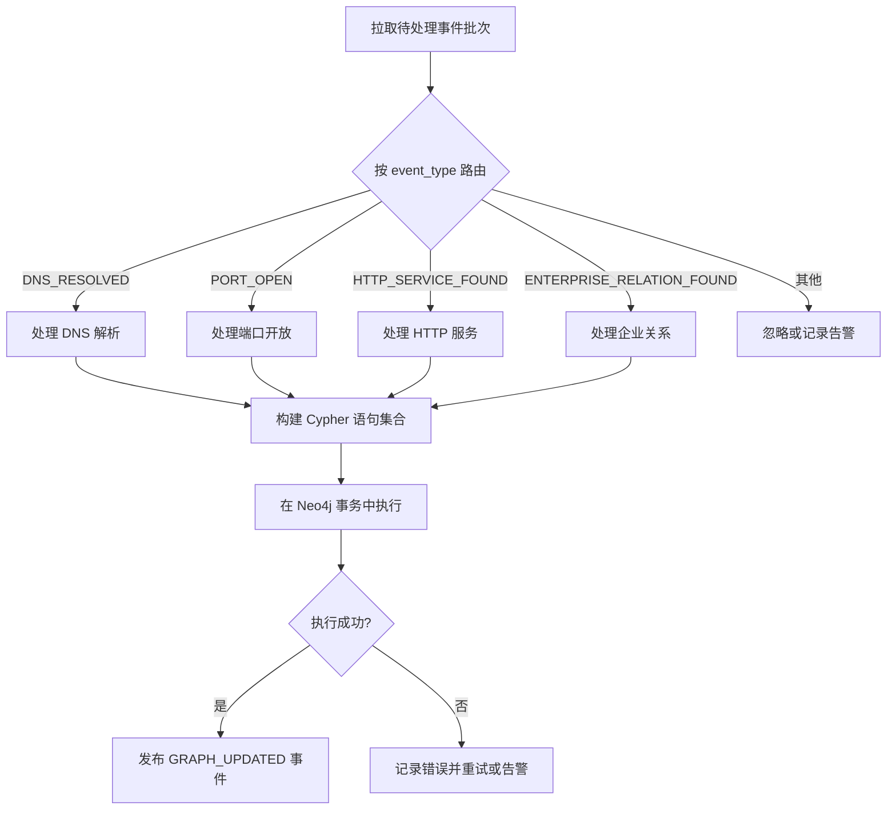
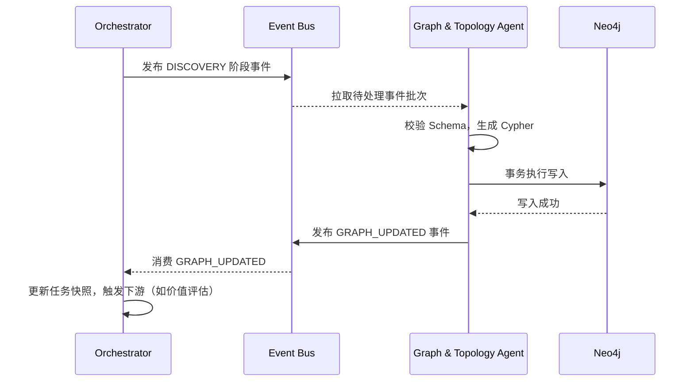

# Graph & Topology Agent 

## 1. 模块定位与任务描述

### 1.1 模块定位
- **模块名称**：Graph & Topology Agent（图谱聚合模块）
- **所属层级**：聚合后端 - 统一事实底座
- **核心职责**：作为系统中 **唯一的图谱写入入口**，接收上游 Agent 产出的标准化 `ObservationEvent`，将其中的实体（Domain、IP、Port、Service、Organization、Person 等）、资产（WebAsset、Host 等）、证据（Evidence）以及它们之间的关系，以**幂等、可追溯、可回放**的方式写入 Neo4j 图数据库，构建统一的知识图谱。

### 1.2 在 Runtime 中的角色
根据 `2.第一阶段多Agent功能拆解与协同架构设计.md` 规定：
- **角色**：`Specialist Agent`（能力域执行单元）
- **触发者**：由 `Orchestrator Agent` 在收到 `ENTITY_FOUND`、`ASSET_DISCOVERED`、`RELATION_INFERRED` 等事件后，批量或增量触发本模块。
- **协作方式**：仅消费 `ObservationEvent`，不主动调用其他 Agent，不直接对外暴露查询 API（查询由 `GraphQueryService` 负责）。

### 1.3 输入与输出

| 项目 | 描述 | 格式/结构 |
| :--- | :--- | :--- |
| **主要输入** | `ObservationEvent` 列表（来自 Event Bus） | `ObservationEvent[]` |
| **主要输出** | 图谱写入确认事件（`GRAPH_UPDATED`），包含本次写入的节点/边统计 | `ObservationEvent`（type=`GRAPH_UPDATED`） |
| **运行范式** | PLAN（规划-执行） | 确定性写入流程 |

### 1.4 核心价值
- **统一入口**：避免多 Agent 直连 Neo4j 导致的数据不一致、重复写入和 Schema 漂移。
- **幂等去重**：基于实体唯一标识符的 MERGE 策略，确保同一实体在图中唯一。
- **关系聚合**：将分散在不同事件中的关系（如 DNS 解析、端口开放、归属关系）统一建模，形成可查询的拓扑。
- **证据链绑定**：所有节点和关系的创建都绑定 `evidence_refs`，保证图谱中的每一条边都可追溯到原始证据。

---

## 2. 边界、约束与默认策略

### 2.1 模块边界

| 本模块职责 | 非本模块职责 |
| :--- | :--- |
| 消费 `ObservationEvent` 并转换为图谱写入操作 | 主动发起资产发现或指纹识别 |
| 节点与关系的幂等创建（MERGE） | 提供图谱查询服务（由 `GraphQueryService` 负责） |
| 证据引用与图谱元素的关联 | 生成报告或进行价值评估 |
| 维护图数据的一致性与完整性 | 处理复杂业务逻辑（如冲突裁决，应交由 Review Agent） |
| 支持图谱数据的增量更新与全量重建（基于事件重放） | 管理任务生命周期或状态机推进 |

### 2.2 核心约束
- **唯一写入入口**：系统中所有对 Neo4j 的写入操作必须通过本模块完成，禁止其他 Agent 直连图数据库。
- **幂等性保证**：所有节点和关系必须使用 `MERGE` 语义，基于唯一标识符（如 `asset_id`、`entity_id`）进行操作。
- **事务性**：同一批次的 `ObservationEvent` 应在单个 Neo4j 事务中提交，保证原子性。
- **证据强制绑定**：任何关系的创建都必须至少附带一个 `evidence_ref`，否则视为无效关系并记录告警。
- **只读依赖**：本模块不修改上游事件数据，仅消费并标记为已处理。

### 2.3 默认策略

| 策略项 | 默认值 | 说明 |
| :--- | :--- | :--- |
| 批量写入大小 | 100 条事件/批次 | 超过此数量分批提交，避免事务过大 |
| 关系方向约定 | `(source)-[r]->(target)` | 关系方向必须明确，例如 `Domain -[:RESOLVES_TO]-> IPAddress` |
| 证据缺失处理 | 记录 WARNING 并跳过该关系创建 | 不阻断其他有效数据的写入 |
| 节点属性更新策略 | `SET` 追加或覆盖（视字段而定） | 对于列表字段（如 `source_tags`）使用 `append`，单值字段使用覆盖 |
| 冲突处理 | 保留最新值，记录冲突日志 | 不自动裁决业务冲突，仅记录供 Review Agent 消费 |

---

## 3. 职责拆解

### 3.1 核心职责

1. **事件消费与解析**：
   - 从 Event Bus 拉取待处理的 `ObservationEvent` 批次。
   - 根据 `event_type` 路由到对应的处理器（Handler）。

2. **实体与资产节点管理**：
   - 对 `Domain`、`IPAddress`、`Port`、`Service`、`WebAsset`、`Organization`、`Person` 等节点执行幂等创建。
   - 处理节点属性的更新（如 `last_seen`、`status`、`banner`）。

3. **关系创建与维护**：
   - 根据事件携带的线索创建关系（如 `RESOLVES_TO`、`HAS_PORT`、`RUNS_SERVICE`、`BELONGS_TO`）。
   - 防止重复关系创建（基于关系唯一键）。

4. **证据链绑定**：
   - 为每条关系记录 `evidence_refs` 列表，支持前端和审计系统追溯结论来源。

5. **去重与冲突处理**：
   - 基于实体唯一标识符（如 IP 地址、域名 + 端口组合）进行去重。
   - 对属性冲突（如同一端口的服务指纹变化）采用“最新优先”策略，并记录变更历史。

6. **写入统计与事件反馈**：
   - 统计本次写入创建的节点数、关系数。
   - 产生 `GRAPH_UPDATED` 事件，供 Orchestrator 和前端刷新使用。

### 3.2 非职责（明确不做）
- **不执行图谱查询**：查询逻辑由独立的 `GraphQueryService` 实现。
- **不进行推理或价值判断**：不生成新的实体间关系（如链路推断，应由 Chain Hint Agent 负责）。
- **不处理业务冲突裁决**：发现冲突时仅记录，不自动解决。
- **不维护任务状态**：本模块无状态，每次调用独立执行。

### 3.3 与其他模块的职责边界

| 相邻模块 | 本模块做什么 | 本模块不做什么 |
| :--- | :--- | :--- |
| **基础发现模块** | 消费其产出的 `PORT_OPEN`、`HTTP_SERVICE_FOUND` 事件，创建 IP、Port、WebAsset 节点及关系 | 不执行端口扫描或 HTTP 探测 |
| **企业情报模块** | 消费其产出的 `Company`、`Person` 实体及 `LEGAL_PERSON` 等关系 | 不爬取 ICP 或企业信息 |
| **链路提示模块** | 接收其产出的 `RELATION_INFERRED` 事件，创建推断关系（需标记 `inferred=true`） | 不执行关联推断算法 |
| **价值评估模块** | 为其提供图谱数据查询支持（通过查询服务） | 不计算资产价值分数 |
| **Orchestrator** | 接收其下发的 `AgentTask`，返回执行结果 | 不参与任务调度决策 |

---

## 4. 输入/输出契约

### 4.1 输入：`ObservationEvent`（消费的事件类型）

本模块仅处理以下 `event_type` 的事件，其他类型忽略：

| 事件类型 | 来源 Agent | 产生的图谱操作 |
| :--- | :--- | :--- |
| `DNS_RESOLVED` | 基础发现模块 | 创建/更新 Domain、IPAddress 节点；创建 `RESOLVES_TO` 关系 |
| `PORT_OPEN` | 基础发现模块 | 创建 IPAddress、Port 节点；创建 `HAS_PORT` 关系 |
| `HTTP_SERVICE_FOUND` | 基础发现模块 | 创建 WebAsset、Port、Service 节点；创建 `RUNS_SERVICE`、`HAS_PORT` 关系 |
| `ENTERPRISE_ENTITY_FOUND` | 企业情报模块 | 创建 Organization、Person 节点 |
| `ENTERPRISE_RELATION_FOUND` | 企业情报模块 | 创建 `LEGAL_PERSON`、`SHAREHOLDER`、`INVEST` 等关系 |
| `FINGERPRINT_IDENTIFIED` | 指纹识别模块 | 更新 WebAsset 或 Service 节点的 `technology_stack` 属性 |
| `RELATION_INFERRED` | 链路提示模块 | 创建推断关系（需附带 `inferred=true` 和低权重） |

**事件 Payload 规范**：上游 Agent 产出的 `ObservationEvent` 必须包含 `payload` 字段，其结构需符合本模块定义的 Schema（见 4.3）。

### 4.2 输出：`ObservationEvent`（type=`GRAPH_UPDATED`）

本模块执行完成后，向 Event Bus 发布一个 `GRAPH_UPDATED` 事件：

```json
{
  "task_id": "string",
  "agent_id": "graph_topology_agent",
  "event_type": "GRAPH_UPDATED",
  "timestamp": "ISO8601",
  "payload": {
    "batch_id": "string",
    "nodes_created": 0,
    "nodes_updated": 0,
    "relationships_created": 0,
    "warnings": ["string"]
  }
}
```

### 4.3 事件 Payload Schema 定义

为保障写入规范，本模块要求上游事件 payload 遵循以下 Schema：

#### DNS_RESOLVED

```json
{
  "domain": "string (required)",
  "a_records": ["string"],
  "aaaa_records": ["string"],
  "cname_records": ["string"],
  "evidence_refs": ["string (required)"]
}
```

#### PORT_OPEN

```json
{
  "ip": "string (required)",
  "port": "integer (required)",
  "protocol": "tcp | udp",
  "evidence_refs": ["string (required)"]
}
```

#### HTTP_SERVICE_FOUND

```json
{
  "url": "string (required)",
  "ip": "string (required)",
  "port": "integer (required)",
  "status_code": "integer",
  "title": "string",
  "tls": {
    "sni": "string",
    "issuer_cn": "string"
  },
  "evidence_refs": ["string (required)"]
}
```

#### ENTERPRISE_RELATION_FOUND

```json
{
  "source_entity_id": "string (required)",
  "target_entity_id": "string (required)",
  "relation_type": "LEGAL_PERSON | SHAREHOLDER | INVEST | EMPLOY",
  "properties": {
    "ratio": "float (optional)",
    "role_title": "string (optional)"
  },
  "evidence_refs": ["string (required)"]
}
```

### 4.4 图谱节点与关系数据模型（Neo4j）

#### 节点标签与属性

| 标签 | 唯一标识属性 | 其他属性 |
| :--- | :--- | :--- |
| `Domain` | `name` (FQDN) | `registered_domain`, `first_seen`, `last_seen`, `source_tags` |
| `IPAddress` | `address` | `version` (4/6), `first_seen`, `last_seen` |
| `Port` | `id` (ip:port) | `number`, `protocol`, `first_seen`, `last_seen` |
| `Service` | `id` (ip:port) | `name`, `version`, `banner`, `first_seen`, `last_seen` |
| `WebAsset` | `url` (normalized) | `title`, `status_code`, `final_url`, `tls_issuer`, `first_seen`, `last_seen` |
| `Organization` | `id` (credit_code 或 hash) | `name`, `status`, `source_tags` |
| `Person` | `id` (source:internal_id) | `name`, `source_tags`, `ambiguity` |
| `Evidence` | `evidence_id` | `type`, `storage_path`, `hash`, `fetched_at` |

#### 关系类型与方向

| 关系类型 | 方向 | 属性 | 语义 |
| :--- | :--- | :--- | :--- |
| `[:RESOLVES_TO]` | (Domain) → (IPAddress) | `record_type` (A/AAAA/CNAME), `last_resolved`, `evidence_refs` | DNS 解析 |
| `[:HAS_PORT]` | (IPAddress) → (Port) | `discovery_method`, `evidence_refs` | IP 开放端口 |
| `[:RUNS_SERVICE]` | (Port) → (Service) | `confidence`, `evidence_refs` | 端口运行的服务 |
| `[:HOSTS]` | (IPAddress) → (WebAsset) | `port`, `evidence_refs` | IP 上托管的 Web 资产 |
| `[:BELONGS_TO]` | (Domain\|IPAddress\|WebAsset) → (Organization) | `source`, `evidence_refs` | 资产归属 |
| `[:LEGAL_PERSON]` | (Person) → (Organization) | `evidence_refs` | 法人 |
| `[:SHAREHOLDER]` | (Person\|Organization) → (Organization) | `ratio`, `evidence_refs` | 股东 |
| `[:INVEST]` | (Organization) → (Organization) | `ratio`, `evidence_refs` | 投资关系 |
| `[:REFERENCES]` | (any) → (Evidence) | `evidence_type` | 证据引用 |

---

## 5. 处理流程设计

### 5.1 总体流程图



### 5.2 详细处理逻辑

#### Stage 1：事件拉取与预处理
- 从 Event Bus 拉取状态为 `PENDING` 且 `event_type` 为本模块关注的事件。
- 最多拉取 100 条（可配置），形成批次。
- 校验每个事件的 `payload` 是否符合 Schema，不符合的记录 WARNING 并跳过。

#### Stage 2：按类型生成图谱操作
为每种事件类型定义独立的处理器（Handler），输出待执行的 Cypher 语句列表。

**示例：处理 `DNS_RESOLVED`**

```python
def handle_dns_resolved(event):
    cyphers = []
    domain = event.payload["domain"]
    evidence = event.payload["evidence_refs"]

    # 1. MERGE Domain 节点
    cyphers.append(
        "MERGE (d:Domain {name: $domain}) "
        "SET d.last_seen = timestamp() "
        "ON CREATE SET d.first_seen = timestamp()"
    )

    # 2. 对每个 IP 执行 MERGE 并创建关系
    for ip in event.payload["a_records"] + event.payload["aaaa_records"]:
        cyphers.append(
            "MERGE (i:IPAddress {address: $ip}) "
            "ON CREATE SET i.first_seen = timestamp() "
            "SET i.last_seen = timestamp()"
        )
        cyphers.append(
            "MATCH (d:Domain {name: $domain}) "
            "MATCH (i:IPAddress {address: $ip}) "
            "MERGE (d)-[r:RESOLVES_TO]->(i) "
            "SET r.last_resolved = timestamp(), "
            "    r.record_type = $record_type, "
            "    r.evidence_refs = coalesce(r.evidence_refs, []) + $evidence"
        )
    return cyphers
```

**示例：处理 `PORT_OPEN`**

```python
def handle_port_open(event):
    ip = event.payload["ip"]
    port = event.payload["port"]
    protocol = event.payload["protocol"]
    evidence = event.payload["evidence_refs"]

    port_id = f"{ip}:{port}"

    cyphers = [
        # MERGE Port 节点
        "MERGE (p:Port {id: $port_id}) "
        "SET p.number = $port, p.protocol = $protocol, p.last_seen = timestamp() "
        "ON CREATE SET p.first_seen = timestamp()",
        # 创建 HAS_PORT 关系
        "MATCH (i:IPAddress {address: $ip}) "
        "MATCH (p:Port {id: $port_id}) "
        "MERGE (i)-[r:HAS_PORT]->(p) "
        "SET r.discovery_method = 'port_scan', "
        "    r.evidence_refs = coalesce(r.evidence_refs, []) + $evidence"
    ]
    return cyphers
```

#### Stage 3：事务执行与冲突处理
- 将所有 Cypher 语句打包在一个 Neo4j 事务中执行。
- 若执行失败，记录详细错误日志，并将该批次事件标记为 `FAILED`，由 Orchestrator 决定是否重试。
- 对于属性冲突（如已有服务指纹与新指纹不一致），采用 **最新值覆盖** 策略，并将变更写入 `Service` 节点的 `history` 属性（可选）。

#### Stage 4：结果统计与事件发布
- 统计本次写入创建的节点数、关系数。
- 产生 `GRAPH_UPDATED` 事件，发布至 Event Bus。
- 将已处理的事件标记为 `PROCESSED`。

---

## 6. 关键算法分析

### 6.1 实体唯一标识符生成算法

为确保节点在图中唯一，必须使用稳定且唯一的标识符。

| 实体类型 | 唯一标识符生成规则 | 示例 |
| :--- | :--- | :--- |
| Domain | 完全限定域名（FQDN），小写 | `api.example.com` |
| IPAddress | IPv4 或 IPv6 地址字符串 | `192.168.1.1` |
| Port | `{ip}:{port}` | `192.168.1.1:443` |
| Service | `{ip}:{port}`（与 Port 共用 ID） | `192.168.1.1:443` |
| WebAsset | 规范化的 URL（scheme://host:port/） | `https://example.com:443/` |
| Organization | 优先 `credit_code`，否则 `hash(normalized_name)` | `company:91110000...` |
| Person | `{source}:{source_person_id}`，若无则 `temp:{task_id}:{seq}` | `qichacha:123456` |

### 6.2 关系幂等创建算法

使用 Cypher `MERGE` 语句确保关系不重复创建，同时使用 `coalesce` 追加证据引用。

```cypher
MATCH (d:Domain {name: $domain})
MATCH (i:IPAddress {address: $ip})
MERGE (d)-[r:RESOLVES_TO]->(i)
ON CREATE SET r.first_seen = timestamp()
SET r.last_resolved = timestamp(),
    r.record_type = $record_type,
    r.evidence_refs = coalesce(r.evidence_refs, []) + $evidence_refs
```

### 6.3 端口与服务指纹合并算法

当多个事件报告同一 IP 和端口的不同服务信息时，执行智能合并：

```python
def merge_service_info(ip, port, new_banner, new_version):
    # 1. 读取现有 Service 节点
    existing = graph.run("MATCH (s:Service {id: $id}) RETURN s", id=f"{ip}:{port}").single()

    if existing:
        # 2. 若版本更新，覆盖旧版本
        if new_version and new_version != existing.get("version"):
            graph.run("MATCH (s:Service {id: $id}) SET s.version = $new_version", ...)

        # 3. 若 banner 不同，追加或更新
        if new_banner and new_banner != existing.get("banner"):
            graph.run("MATCH (s:Service {id: $id}) SET s.banner = $new_banner", ...)
    else:
        # 4. 创建新节点
        graph.run("CREATE (s:Service {id: $id, port: $port, version: $version, banner: $banner})", ...)
```

---

## 7. 与 Orchestrator 的协作流程



---

## 8. 错误处理与降级策略

| 错误场景 | 处理方式 |
| :--- | :--- |
| 事件 payload Schema 校验失败 | 记录 WARNING，跳过该事件，不影响批次其他事件 |
| Neo4j 连接失败 | 重试 3 次（指数退避），仍失败则标记批次失败，通知 Orchestrator |
| 证据引用缺失 | 关系创建时记录 WARNING，但仍创建关系（`evidence_refs` 置为空数组） |
| 事务超时（>30秒） | 减小批次大小（如 50 条）重试 |
| 写入部分失败 | Neo4j 事务自动回滚，整个批次重试 |

---

## 9. 测试计划与验收标准

### 9.1 单元测试

| 测试用例 | 验收标准 |
| :--- | :--- |
| `handle_dns_resolved` 正常流程 | 正确生成 Domain、IPAddress 节点及 RESOLVES_TO 关系 |
| `handle_port_open` 正常流程 | 正确生成 Port 节点及 HAS_PORT 关系 |
| 重复事件幂等性 | 多次处理同一事件不会创建重复节点或关系 |
| 证据引用追加 | 多次处理追加证据时，`evidence_refs` 列表正确累加 |
| Schema 校验失败 | 事件被跳过，WARNING 记录 |

### 9.2 集成测试

| 场景 | 验收标准 |
| :--- | :--- |
| 端到端：基础发现 → 图谱聚合 | 基础发现产出的 DNS、端口、HTTP 事件成功写入图谱，可通过查询验证 |
| 端到端：企业情报 → 图谱聚合 | 企业情报产出的公司、法人关系成功写入图谱 |
| Neo4j 断连恢复 | 重连后能继续处理积压事件 |

### 9.3 验收标准
- **唯一写入入口**：系统中不存在其他直接写 Neo4j 的代码路径。
- **幂等性**：同一批次事件重放不会产生重复数据。
- **证据绑定**：所有关系节点均可通过 `evidence_refs` 追溯到原始事件。
- **性能指标**：单批次（100 条事件）处理时间 < 5 秒。

---

## 10. 参考实现骨架

```python
# agents/specialist/graph_topology_agent.py

from runtime.base import SpecialistAgent, AgentContext, ObservationEvent

class GraphTopologyAgent(SpecialistAgent):
    agent_type = "GraphTopologyAgent"

    def __init__(self, graph_adapter, event_bus):
        self.graph_adapter = graph_adapter
        self.event_bus = event_bus
        self.handlers = {
            "DNS_RESOLVED": self.handle_dns_resolved,
            "PORT_OPEN": self.handle_port_open,
            "HTTP_SERVICE_FOUND": self.handle_http_service,
            "ENTERPRISE_RELATION_FOUND": self.handle_enterprise_relation,
        }

    async def execute(self, context: AgentContext):
        events = self._fetch_pending_events(context.task_id)
        cyphers = []
        warnings = []

        for event in events:
            handler = self.handlers.get(event.event_type)
            if not handler:
                continue

            if not self._validate_schema(event):
                warnings.append(f"Schema validation failed for event {event.event_id}")
                continue

            cyphers.extend(handler(event))

        if cyphers:
            try:
                stats = self.graph_adapter.execute_transaction(cyphers)
                self._publish_graph_updated_event(context.task_id, stats, warnings)
                self._mark_events_processed(events)
            except Exception as e:
                self._handle_failure(context.task_id, events, e)
        else:
            self._mark_events_processed(events)

    def handle_dns_resolved(self, event):
        # 实现见 5.2 节
        pass

    # 其他 handler...
```


