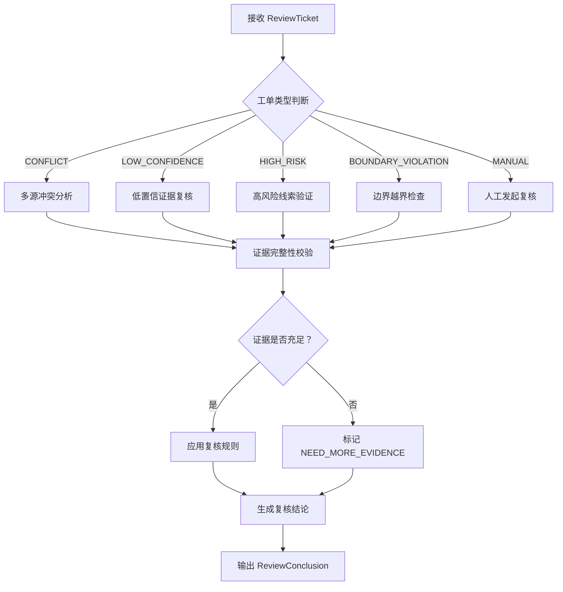
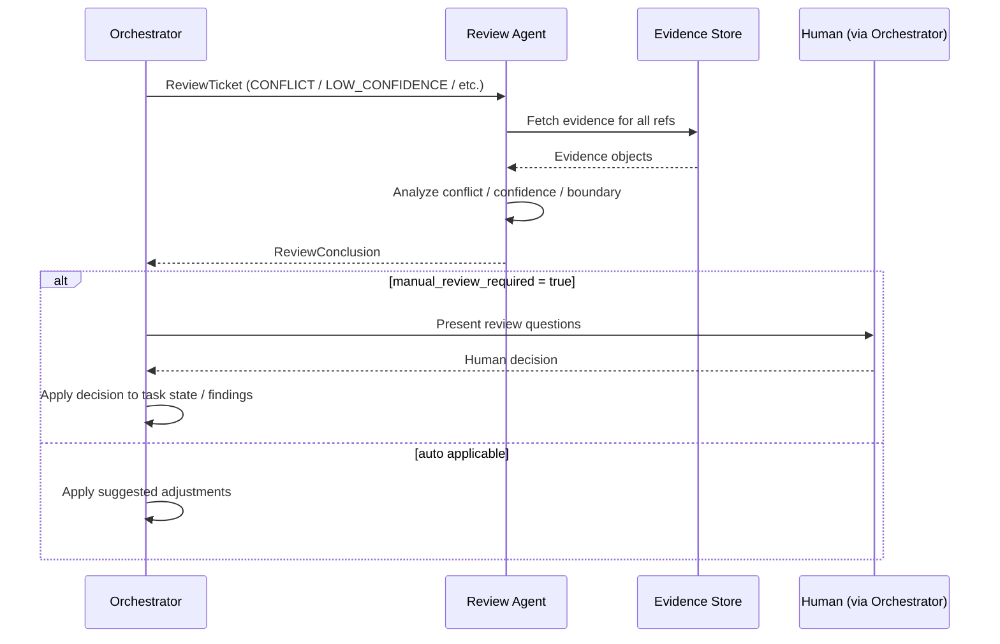

# Review Agent 设计与实现文档

## 1. 模块定位与任务描述

### 1.1 模块定位
- **模块名称**：Review Agent（复核模块）
- **所属层级**：聚合后端 - 控制与治理层
- **核心职责**：接收来自 Orchestrator 或其他 Agent 升级的复核请求，对高风险、低置信、冲突结论、越界发现进行结构化复核，生成可审计的复核结论，并向 Orchestrator 返回明确的处置建议（确认/驳回/待补充证据）。**本模块不做最终人工决策，而是为人工研判提供聚合证据、标准化工单和决策支撑**。

### 1.2 在 Runtime 中的角色
根据 `2.第一阶段多Agent功能拆解与协同架构设计.md` 规定：
- **角色**：`Review Agent`（运行时安全阀与质量阀）
- **触发者**：仅由 `Orchestrator Agent` 在满足复核触发条件时创建 `ReviewTicket` 并路由至本模块。
- **协作方式**：不直接调用其他 Agent，不主动发起扫描或探测，仅消费上游提供的证据与冲突上下文，输出 `ReviewConclusion`。

### 1.3 输入与输出

| 项目 | 描述 | 格式/结构 |
| :--- | :--- | :--- |
| **主要输入** | 复核工单（`ReviewTicket`），包含待复核的发现、冲突上下文、证据引用、风险等级、来源 Agent 等 | `ReviewTicket` JSON Object |
| **主要输出** | 复核结论（`ReviewConclusion`），包含复核结果、置信度调整、处置建议、证据聚合摘要 | `ReviewConclusion` JSON Object |
| **运行范式** | REFLECT（反思与修正） | 内部推理循环 |

### 1.4 核心价值
- **阻断错误扩散**：在低置信结论、冲突结论进入最终报告或下游决策前进行拦截。
- **证据聚合与降噪**：将多个 Agent 产生的分散证据聚合成可人工快速消费的摘要视图。
- **标准化复核流程**：提供统一的复核工单结构，确保每一次人工介入都有据可查、可追溯。
- **质量闸门**：作为任务进入 `DONE` 或 `REPORTING` 前的可选质量检查点。

---

## 2. 边界、约束与默认策略

### 2.1 模块边界

| 本模块职责 | 非本模块职责 |
| :--- | :--- |
| 接收并解析 `ReviewTicket` | 主动发起漏洞验证或额外扫描 |
| 聚合冲突证据与多源结论 | 代替人工做出最终决策（所有结论均需人工确认或由上游规则自动采纳） |
| 生成结构化复核建议（确认/驳回/待补充） | 修改原始发现或图谱数据 |
| 输出可审计的复核记录 | 直接与前端用户交互（由 Orchestrator 或 Result Aggregator 转发） |
| 对证据完整性、一致性进行自动校验 | 执行复杂逻辑推理或攻击链推断 |

### 2.2 核心约束
- **最高置信度限制**：本模块输出的复核结论，其建议采纳的置信度上限为 `medium`，不得输出 `high`，强制保留人工最终确认环节。
- **不修改原始数据**：本模块只读原始发现与证据，不修改 `ObservationEvent`、`Finding`、`GraphNode` 等上游数据。
- **可追溯性**：每条复核结论必须包含 `review_id`、`task_id`、`source_ticket_id`、`evidence_refs`，支持全链路审计。
- **无状态设计**：本模块不维护跨任务的会话状态，每次调用独立完成。
- **超时控制**：单次复核处理最长执行时间 `30` 秒，超时返回 `REVIEW_TIMEOUT` 并建议人工接管。

### 2.3 默认策略

| 策略项 | 默认值 | 说明 |
| :--- | :--- | :--- |
| 冲突证据采纳规则 | `majority_vote` | 当多源证据冲突时，优先采纳置信度高、来源多样性强的结论 |
| 证据不足处理 | `request_more_evidence` | 当证据不足以支撑任何结论时，返回 `NEED_MORE_EVIDENCE` 状态 |
| 自动确认阈值 | `confidence >= 0.9` 且无冲突 | 仅当置信度极高且无任何冲突证据时，可建议自动确认（仍需人工最终审核） |
| 输出格式 | 结构化 JSON | 不输出自然语言散文，仅输出字段明确的 JSON |
| 最大复核项数量 | 单次 `50` 条 finding | 超过则分批或由 Orchestrator 聚合后再送审 |

---

## 3. 职责拆解

### 3.1 核心职责

1. **复核工单解析与分类**：
   - 识别 `ReviewTicket` 的类型（`CONFLICT`、`LOW_CONFIDENCE`、`HIGH_RISK`、`BOUNDARY_VIOLATION`）。
   - 提取待复核的实体、发现、证据引用及冲突描述。

2. **证据完整性自动校验**：
   - 检查每条待复核发现的证据引用是否可访问、是否完整（非空、非截断）。
   - 标记缺失证据或证据链断裂的情况。

3. **多源结论冲突分析**：
   - 当同一实体存在多个 Agent 给出不同结论时，分析冲突类型（版本冲突、组件冲突、归属冲突等）。
   - 按预设规则（如置信度优先、来源多样性优先）给出推荐采纳项。

4. **低置信发现复核**：
   - 对置信度低于阈值（默认 `0.6`）的发现，评估其证据强度是否足以提升置信度。
   - 给出“可提升至 medium”、“维持低置信”、“建议忽略”等建议。

5. **高风险线索复核**：
   - 对标记为 `risk_level=high` 或 `critical` 的发现，确认其证据是否充分、是否存在误报可能。
   - 输出风险确认或降级建议。

6. **边界越界复核**：
   - 检查发现是否超出任务契约授权的目标范围（如第三方域名、禁止网段）。
   - 给出“应排除”或“需人工确认范围”的建议。

7. **复核结论生成**：
   - 输出统一的 `ReviewConclusion`，包含复核状态、建议动作、置信度调整、证据摘要、待人工确认项。

### 3.2 非职责（明确不做）
- **不做最终决策**：不直接修改任务状态为 `DONE` 或直接丢弃发现。
- **不主动调用其他 Agent**：不请求基础发现、指纹识别等模块补跑数据。
- **不修改图谱或报告**：仅输出建议，由 Orchestrator 或 Result Aggregator 决定是否采纳。
- **不进行实时交互**：不提供前端实时对话接口，仅为异步任务。

### 3.3 与其他模块的职责边界

| 相邻模块 | 本模块做什么 | 本模块不做什么 |
| :--- | :--- | :--- |
| **Orchestrator** | 接收 `ReviewTicket`，返回 `ReviewConclusion` | 不主动向 Orchestrator 请求任务或触发其他 Agent |
| **Value Assessment Agent** | 消费其产出的高价值但低置信的发现 | 不重新计算资产价值分数 |
| **Graph & Topology Agent** | 接收图谱冲突（如实体归并冲突）的复核请求 | 不直接操作图数据库 |
| **Report Agent** | 在报告生成前提供质量检查 | 不修改报告内容 |
| **前端/人工** | 通过 Orchestrator 提供结构化复核工单供人工研判 | 不提供直接面向用户的操作界面 |

---

## 4. 输入/输出契约

### 4.1 ReviewTicket（复核工单）

由 Orchestrator 或其他 Agent 创建并发送至 Review Agent。

```json
{
  "ticket_id": "string (required)",
  "task_id": "string (required)",
  "created_at": "string (ISO8601, required)",
  "trigger_reason": "CONFLICT | LOW_CONFIDENCE | HIGH_RISK | BOUNDARY_VIOLATION | MANUAL",
  "priority": "LOW | MEDIUM | HIGH | CRITICAL",
  "source_agent": "string (required)",
  "target_entity": {
    "entity_type": "finding | asset | graph_node | relation",
    "entity_id": "string",
    "entity_summary": "string"
  },
  "conflicting_items": [
    {
      "source": "string",
      "conclusion": "object",
      "confidence": "float",
      "evidence_refs": ["string"]
    }
  ],
  "findings": [
    {
      "finding_id": "string",
      "title": "string",
      "confidence": "float",
      "risk_level": "string",
      "evidence_refs": ["string"]
    }
  ],
  "context": {
    "task_scope": "object",
    "allowed_targets": ["string"],
    "denied_targets": ["string"]
  },
  "review_policy": {
    "auto_confirm_threshold": 0.9,
    "require_manual_approval": true,
    "max_review_items": 50
  },
  "notes": "string (optional)"
}
```

**字段说明**：

| 字段 | 类型 | 必填 | 说明 |
| :--- | :--- | :--- | :--- |
| `ticket_id` | string | 是 | 工单唯一标识 |
| `task_id` | string | 是 | 所属任务 ID |
| `created_at` | string | 是 | 工单创建时间 |
| `trigger_reason` | enum | 是 | 触发复核的原因 |
| `priority` | enum | 是 | 工单优先级 |
| `source_agent` | string | 是 | 发起复核的 Agent 类型 |
| `target_entity` | object | 是 | 待复核的核心实体 |
| `conflicting_items` | array | 否 | 冲突的多源结论列表（当 `trigger_reason=CONFLICT` 时必填） |
| `findings` | array | 否 | 待复核的发现列表 |
| `context` | object | 否 | 任务上下文，用于边界越界复核 |
| `review_policy` | object | 否 | 复核策略配置 |
| `notes` | string | 否 | 人工备注 |

### 4.2 ReviewConclusion（复核结论）

由 Review Agent 输出，返回给 Orchestrator。

```json
{
  "review_id": "string (required)",
  "ticket_id": "string (required)",
  "task_id": "string (required)",
  "status": "COMPLETED | PARTIAL | FAILED | TIMEOUT",
  "review_result": {
    "action": "CONFIRM | REJECT | NEED_MORE_EVIDENCE | MANUAL_REQUIRED | EXCLUDE_FROM_SCOPE",
    "adjusted_confidence": "float (optional)",
    "recommended_risk_level": "string (optional)",
    "reason": "string (required)"
  },
  "findings_review": [
    {
      "finding_id": "string",
      "verdict": "CONFIRMED | REJECTED | UNCERTAIN",
      "adjusted_confidence": "float",
      "evidence_summary": "string",
      "notes": "string"
    }
  ],
  "conflict_resolution": {
    "recommended_item_index": "integer (optional)",
    "reason": "string"
  },
  "evidence_completeness": {
    "all_evidence_accessible": "boolean",
    "missing_evidence_refs": ["string"],
    "integrity_issues": ["string"]
  },
  "manual_review_required": "boolean",
  "manual_review_questions": [
    {
      "question": "string",
      "context": "string"
    }
  ],
  "audit_trail": {
    "analyzed_at": "string (ISO8601)",
    "rules_applied": ["string"],
    "processing_time_ms": "integer"
  }
}
```

**字段说明**：

| 字段 | 类型 | 必填 | 说明 |
| :--- | :--- | :--- | :--- |
| `review_id` | string | 是 | 本次复核唯一标识 |
| `ticket_id` | string | 是 | 关联的工单 ID |
| `task_id` | string | 是 | 所属任务 ID |
| `status` | enum | 是 | 复核执行状态 |
| `review_result.action` | enum | 是 | 建议动作 |
| `adjusted_confidence` | float | 否 | 调整后的置信度（若适用） |
| `reason` | string | 是 | 建议原因 |
| `findings_review` | array | 是 | 对每个待复核发现的逐项结论 |
| `conflict_resolution` | object | 否 | 冲突解决建议 |
| `evidence_completeness` | object | 是 | 证据完整性检查结果 |
| `manual_review_required` | boolean | 是 | 是否仍需人工复核 |
| `manual_review_questions` | array | 否 | 向人工提出的具体问题 |
| `audit_trail` | object | 是 | 审计追踪信息 |

---

## 5. 处理流程设计

### 5.1 总体流程图



### 5.2 详细步骤

#### Stage 1：工单解析与分类
- 读取 `ReviewTicket`，提取 `trigger_reason` 和待复核项。
- 按类型路由到不同的分析分支。

#### Stage 2：证据完整性校验
- 遍历 `findings` 和 `conflicting_items` 中的所有 `evidence_refs`。
- 通过 Evidence Store 接口检查证据是否存在、是否可访问、是否完整（非空、非截断标记）。
- 记录缺失或异常的 evidence_refs。

#### Stage 3：类型化复核分析

| 类型 | 分析逻辑 |
| :--- | :--- |
| **CONFLICT** | 1. 识别冲突类型（版本冲突/组件冲突/归属冲突）。<br>2. 比较各结论的置信度、证据强度、来源多样性。<br>3. 按预设规则（如 `majority_vote`、`highest_confidence`）给出推荐采纳项。<br>4. 若无法自动裁决，标记 `MANUAL_REQUIRED`。 |
| **LOW_CONFIDENCE** | 1. 检查证据是否足以提升置信度（如证据来源可靠、多源交叉验证）。<br>2. 若证据充分，建议提升置信度至 `medium`。<br>3. 若证据薄弱，建议维持低置信或标记为 `REJECT`。 |
| **HIGH_RISK** | 1. 确认风险标记是否有充分证据支撑（如漏洞特征、异常回显）。<br>2. 排除常见误报场景（如测试页面、静态分析误判）。<br>3. 输出风险确认或降级建议。 |
| **BOUNDARY_VIOLATION** | 1. 检查发现的目标是否在 `context.allowed_targets` 内。<br>2. 若明确越界，建议 `EXCLUDE_FROM_SCOPE`。<br>3. 若模糊（如第三方 CDN），标记 `MANUAL_REQUIRED`。 |
| **MANUAL** | 1. 直接标记 `MANUAL_REQUIRED`，并将工单中的问题透传至 `manual_review_questions`。 |

#### Stage 4：复核结论生成
- 汇总所有分析结果，生成 `ReviewConclusion`。
- 若存在证据缺失、冲突无法裁决、边界模糊等情况，设置 `manual_review_required=true`。
- 记录所有应用的规则和耗时。

---

## 6. 关键算法分析

### 6.1 多源冲突裁决算法

**伪代码**：

```python
def resolve_conflict(conflicting_items, policy="majority_vote"):
    if not conflicting_items:
        return None, "no_conflict"

    # 1. 按置信度排序
    sorted_items = sorted(conflicting_items, key=lambda x: x["confidence"], reverse=True)

    # 2. 检查是否存在显著高置信度项（高于次高 0.2 以上）
    if len(sorted_items) >= 2:
        if sorted_items[0]["confidence"] - sorted_items[1]["confidence"] >= 0.2:
            return 0, "highest_confidence_dominant"

    # 3. 按来源多样性加权
    sources = set(item["source"] for item in conflicting_items)
    diversity_bonus = len(sources) * 0.05

    # 4. 计算加权得分
    for item in conflicting_items:
        item["weighted_score"] = item["confidence"] + diversity_bonus

    # 5. 返回最高加权得分项索引
    best_index = max(range(len(conflicting_items)), key=lambda i: conflicting_items[i]["weighted_score"])
    return best_index, "majority_vote_with_diversity"
```

### 6.2 证据完整性自动校验算法

**伪代码**：

```python
def check_evidence_completeness(evidence_refs, evidence_store):
    missing = []
    integrity_issues = []

    for ref in evidence_refs:
        evidence = evidence_store.get(ref)
        if not evidence:
            missing.append(ref)
            continue

        # 检查证据是否被截断
        if evidence.get("truncated", False):
            integrity_issues.append(f"Evidence {ref} is truncated")

        # 检查关键字段是否为空
        if not evidence.get("snippet") and not evidence.get("hash"):
            integrity_issues.append(f"Evidence {ref} has no content")

    all_accessible = len(missing) == 0
    return {
        "all_evidence_accessible": all_accessible,
        "missing_evidence_refs": missing,
        "integrity_issues": integrity_issues
    }
```

---

## 7. 错误处理与降级策略

| 错误场景 | 处理方式 |
| :--- | :--- |
| 工单格式非法 | 返回 `status=FAILED`，`reason="Invalid ticket format"` |
| 证据引用无法访问 | 标记 `evidence_completeness.all_evidence_accessible=false`，设置 `manual_review_required=true` |
| 冲突项超过最大处理数量 | 仅处理前 `max_review_items` 条，其余标记为 `PARTIAL` |
| 分析超时（30秒） | 返回 `status=TIMEOUT`，已分析部分结果仍返回 |
| 无适用复核规则 | 设置 `manual_review_required=true`，输出 `reason="No automated rule applicable"` |

---

## 8. 与 Orchestrator 的协作流程



---

## 9. 测试计划与验收标准

### 9.1 单元测试

| 测试用例 | 验收标准 |
| :--- | :--- |
| 冲突裁决 - 高置信度主导 | 正确选择置信度显著高的项 |
| 冲突裁决 - 多源多样性加权 | 多样性高者加权后胜出 |
| 证据完整性检查 - 全部可访问 | `all_evidence_accessible=true` |
| 证据完整性检查 - 部分缺失 | 正确列出缺失引用 |
| 低置信复核 - 证据充分 | 建议提升置信度 |
| 低置信复核 - 证据薄弱 | 建议维持或驳回 |
| 边界越界检查 - 明确越界 | 建议 `EXCLUDE_FROM_SCOPE` |
| 边界越界检查 - 模糊情况 | 标记 `MANUAL_REQUIRED` |

### 9.2 集成测试

| 场景 | 验收标准 |
| :--- | :--- |
| Orchestrator 创建 CONFLICT 工单 | Review Agent 正确返回裁决建议 |
| Orchestrator 创建 LOW_CONFIDENCE 工单 | Review Agent 正确评估证据并给出调整建议 |
| 证据存储不可用 | Review Agent 标记证据缺失，要求人工介入 |
| 超时场景 | Review Agent 在 30 秒内返回部分结果 |

### 9.3 验收标准
- **功能完整性**：支持 `CONFLICT`、`LOW_CONFIDENCE`、`HIGH_RISK`、`BOUNDARY_VIOLATION`、`MANUAL` 五种工单类型。
- **可审计性**：每条复核结论包含 `review_id`、`audit_trail`、证据引用。
- **人工兜底**：所有无法自动裁决的场景均设置 `manual_review_required=true`。
- **性能指标**：单工单（含 20 条 findings）处理时间 < 5 秒。
- **不修改原数据**：验证 Review Agent 未对 `ObservationEvent` 或 `Finding` 执行写操作。

---

## 10. 参考实现骨架

```python
# agents/review_agent.py

from runtime.base import ReviewAgent as BaseReviewAgent, AgentContext, ReviewTicket, ReviewConclusion

class ReviewAgent(BaseReviewAgent):
    agent_type = "ReviewAgent"

    async def execute(self, context: AgentContext) -> ReviewConclusion:
        ticket = ReviewTicket(**context.input_data)

        # 1. 证据完整性校验
        evidence_check = self._check_evidence(ticket)

        # 2. 按类型路由分析
        if ticket.trigger_reason == "CONFLICT":
            resolution = self._resolve_conflict(ticket.conflicting_items)
        elif ticket.trigger_reason == "LOW_CONFIDENCE":
            resolution = self._review_low_confidence(ticket.findings)
        elif ticket.trigger_reason == "HIGH_RISK":
            resolution = self._review_high_risk(ticket.findings)
        elif ticket.trigger_reason == "BOUNDARY_VIOLATION":
            resolution = self._check_boundary(ticket)
        else:
            resolution = self._manual_review_fallback(ticket)

        # 3. 生成复核结论
        conclusion = ReviewConclusion(
            review_id=self._generate_id(),
            ticket_id=ticket.ticket_id,
            task_id=ticket.task_id,
            status="COMPLETED",
            review_result=resolution,
            evidence_completeness=evidence_check,
            manual_review_required=resolution.get("manual_required", False),
            audit_trail=self._build_audit_trail()
        )
        return conclusion
```

---
