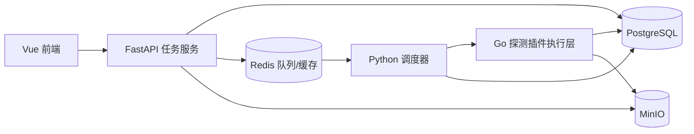
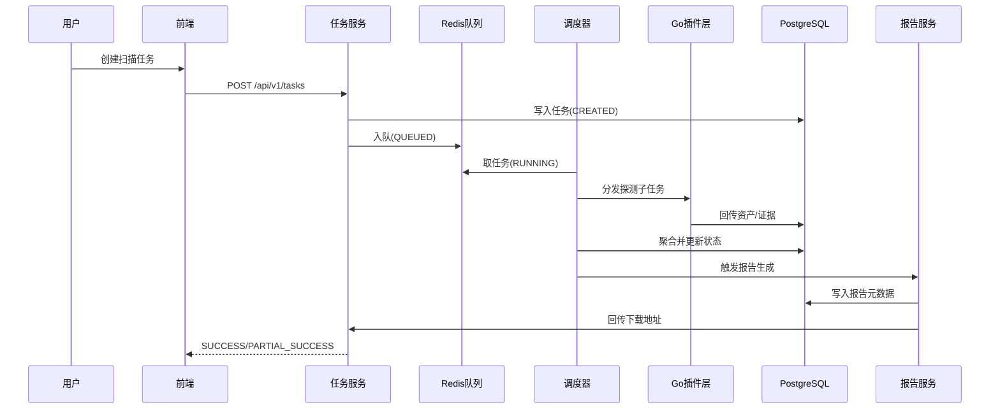
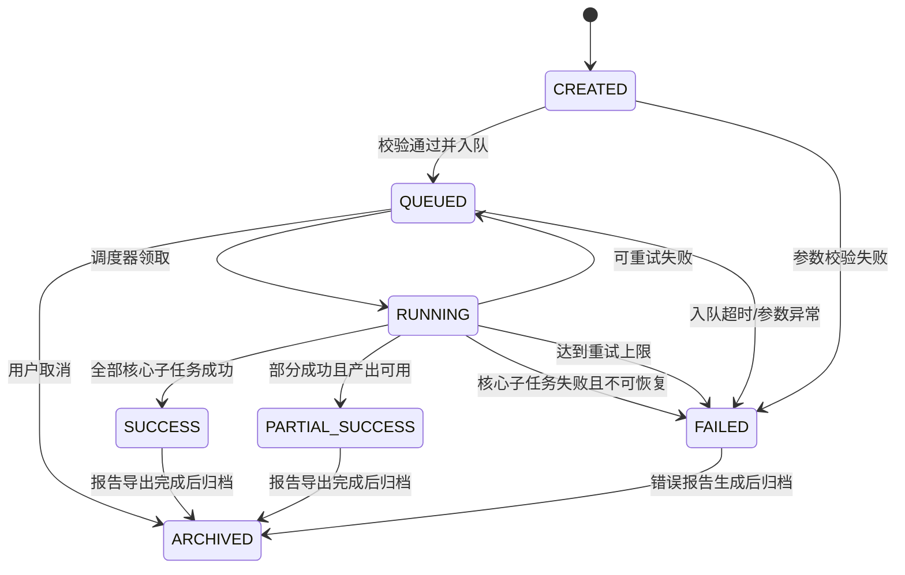

## 1. 阶段1目标与边界（周1-4）

### 1.1 阶段目标

- 在 4 周内交付“可运行、可演示、可验收”的信息收集 MVP 闭环。
- 覆盖“任务创建 -> 资产发现 -> 基础探测 -> 结果聚合 -> 报告导出”主链路。
- 输出研发可直接拆分任务的实现说明，减少阶段执行期二次决策成本。

### 1.2 In Scope（阶段1必须完成）

- 任务创建与调度（队列执行、状态更新、任务取消）。
- 子域名/IP/端口基础发现与资产聚合。
- 基础路径探测（静态字典 v1）。
- 资产指纹识别 v1（响应头、标题、基础特征）。
- 报告导出 v1（资产清单 + 风险线索摘要 + 扫描统计）。
- 基础风险线索标记、失败重试与限速、审计日志。

### 1.3 Out of Scope（阶段1不实现）

- 动态扫描字典自动扩展（阶段2）。
- JS 语义深度解析与被动流量审查（阶段2）。
- 攻击链推荐与高级 Agent 决策（阶段3+）。
- 云服务与代码仓库泄露专项检测（待议能力）。

## 2. 阶段1技术栈落地方案

### 2.1 组件职责

| 组件 | 技术 | 阶段1职责 |
| --- | --- | --- |
| API 网关与任务服务 | Python（FastAPI） | 任务接口、参数校验、状态查询、取消任务、报告下载入口 |
| 调度与编排服务 | Python（Celery/RQ） | 任务入队、插件分发、重试策略、限速策略、状态回写 |
| 探测插件执行层 | Go | 子域/IP/端口/路径探测、证据输出、标准化结果上报 |
| 前端控制台 | Vue 3 + TypeScript | 任务创建页、任务详情页、资产列表页、报告下载入口 |
| 结构化存储 | PostgreSQL | 任务、资产、线索、报告元数据 |
| 队列与缓存 | Redis | 执行队列、任务锁、速率计数、短期缓存 |
| 对象存储 | MinIO | 报告文件与证据附件 |

### 2.2 阶段1部署拓扑（单机/小规模）



## 3. 功能点 WBS 拆分（P0/P1）

> 每项均包含：输入、处理、输出、依赖、完成定义（DoD）。

### 3.1 P0（必须上线）

| 功能点 | 输入 | 处理 | 输出 | 依赖 | 完成定义（DoD） |
| --- | --- | --- | --- | --- | --- |
| 任务创建与调度 | 目标域名/IP、扫描策略、并发参数 | 参数校验、任务入队、初始化状态 | `task_id`、`CREATED/QUEUED` | FastAPI、Redis、PostgreSQL | 可创建任务并在 3s 内进入队列 |
| 子域/IP/端口发现 | `task_id`、目标资产 | 并发探测、去重、归一化 | 资产记录（域名/IP/端口） | Go 插件、DNS/端口库、PostgreSQL | 发现结果可落库并可查询 |
| 基础路径探测 | 主机资产、静态字典 | HTTP 探测、状态码分类、响应采样 | 路径资产与证据 | Go HTTP 探测插件 | 可输出有效路径列表与响应摘要 |
| 指纹识别 v1 | HTTP 响应头/标题/Body 片段 | 规则匹配、置信度评分 | 指纹标签（中间件/CMS/框架） | 规则库 v1、PostgreSQL | 能识别并展示基础技术栈标签 |
| 报告导出 v1 | `task_id` | 汇总资产/线索/统计并渲染模板 | Markdown/PDF 报告文件 | Python 报告服务、MinIO | 任务完成后可下载报告 |

### 3.2 P1（阶段1内建议完成）

| 功能点 | 输入 | 处理 | 输出 | 依赖 | 完成定义（DoD） |
| --- | --- | --- | --- | --- | --- |
| 风险线索标记 v1 | URL、参数键值、响应文本 | 基础规则匹配（如 `id`/`path`/`redirect`） | 风险线索标签与级别 | 规则引擎 v1 | 线索可在任务详情页查看 |
| 资产关系汇总视图 | 资产记录、来源证据 | 聚合域名-IP-端口-路径关系 | 关系列表（非图数据库） | PostgreSQL 视图 | 可按任务生成关系汇总页 |
| 失败重试与限速 | 失败任务、请求频率 | 指数退避、上限重试、速率控制 | 稳定执行结果、失败原因 | Redis 计数器、调度器 | 重试可控，无无限重试 |
| 审计日志 | 操作事件、任务事件 | 结构化记录与查询 | 审计日志明细 | PostgreSQL | 关键操作全链路可追踪 |

## 4. 交互逻辑与状态机

### 4.1 端到端交互流程



### 4.2 任务状态机



### 4.3 取消与重试逻辑

- 取消：仅 `QUEUED/RUNNING` 可取消；`RUNNING` 进入“停止接收新子任务+等待当前子任务超时回收”。
- 重试：按插件粒度重试，避免整任务重跑；重试上限默认 2 次，指数退避（2s/5s）。
- 限速：目标维度与任务维度双限速，命中阈值自动降速并记录审计日志。

## 5. API 与内部契约

### 5.1 外部 REST API（阶段1）

| 接口 | 方法 | 说明 | 关键响应字段 |
| --- | --- | --- | --- |
| `/api/v1/tasks` | POST | 创建任务 | `task_id`、`status`、`created_at` |
| `/api/v1/tasks/{id}` | GET | 查询任务状态与统计 | `status`、`progress`、`summary` |
| `/api/v1/tasks/{id}/cancel` | POST | 取消任务 | `task_id`、`status`、`canceled_at` |
| `/api/v1/tasks/{id}/assets` | GET | 查询资产清单 | `assets[]`、`count` |
| `/api/v1/tasks/{id}/report` | GET | 获取报告下载信息 | `report_url`、`format`、`generated_at` |

### 5.2 内部事件契约（阶段1）

| 事件 | 触发方 | 消费方 | 作用 |
| --- | --- | --- | --- |
| `TaskQueued` | 任务服务 | 调度器 | 通知可执行任务 |
| `AssetDiscovered` | Go 插件层 | 聚合器/任务服务 | 写入资产与来源证据 |
| `ClueDetected` | 规则引擎 | 任务服务/报告服务 | 更新风险线索 |
| `TaskCompleted` | 调度器 | 报告服务 | 触发报告生成 |
| `ReportGenerated` | 报告服务 | 任务服务/前端 | 更新下载地址与完成状态 |

### 5.3 插件 I/O 契约（最小字段）

```json
{
  "target": "example.com",
  "context": {
    "task_id": "uuid",
    "scan_policy": "mvp-default"
  },
  "evidence": [
    {
      "type": "http_response",
      "location": "https://example.com/admin",
      "snippet": "..."
    }
  ],
  "confidence": 0.82,
  "risk_tags": ["potential_exposure"],
  "next_actions": ["path_probe"]
}
```

## 6. 数据模型最小集（字段级）

### 6.1 `tasks`

| 字段 | 类型 | 说明 |
| --- | --- | --- |
| `id` | UUID | 任务主键 |
| `target` | TEXT | 输入目标 |
| `status` | TEXT | 任务状态（状态机枚举） |
| `progress` | INT | 进度百分比 |
| `policy` | JSONB | 扫描策略 |
| `created_at` | TIMESTAMP | 创建时间 |
| `updated_at` | TIMESTAMP | 更新时间 |
| `finished_at` | TIMESTAMP NULL | 完成时间 |

### 6.2 `assets`

| 字段 | 类型 | 说明 |
| --- | --- | --- |
| `id` | UUID | 资产主键 |
| `task_id` | UUID | 所属任务 |
| `asset_type` | TEXT | `domain/ip/port/path/service` |
| `asset_value` | TEXT | 资产值 |
| `fingerprint` | JSONB | 指纹标签与置信度 |
| `source` | TEXT | 来源插件 |
| `created_at` | TIMESTAMP | 发现时间 |

### 6.3 `clues`

| 字段 | 类型 | 说明 |
| --- | --- | --- |
| `id` | UUID | 线索主键 |
| `task_id` | UUID | 所属任务 |
| `asset_id` | UUID NULL | 关联资产 |
| `clue_type` | TEXT | 线索类型 |
| `severity` | TEXT | `low/medium/high` |
| `evidence_ref` | TEXT | 证据引用 |
| `created_at` | TIMESTAMP | 生成时间 |

### 6.4 `reports`

| 字段 | 类型 | 说明 |
| --- | --- | --- |
| `id` | UUID | 报告主键 |
| `task_id` | UUID | 所属任务 |
| `report_url` | TEXT | MinIO 地址 |
| `format` | TEXT | `md/pdf` |
| `summary` | JSONB | 摘要统计 |
| `generated_at` | TIMESTAMP | 生成时间 |

## 7. 四周实施路线（阶段1）

| 周次 | 周目标 | 交付件 | 主要风险 | 验收口径 |
| --- | --- | --- | --- | --- |
| 第1周 | 主链路骨架打通 | 任务 API、队列调度、任务状态流转 | 状态机定义反复变更 | 可创建任务并进入 `RUNNING` |
| 第2周 | 发现能力可用 | 子域/IP/端口探测、资产落库、基础去重 | 插件输出格式不一致 | 资产列表可查询且数据可追溯 |
| 第3周 | 探测与识别闭环 | 路径探测、指纹识别 v1、线索标记 v1 | 误报偏高或超时 | 可产出路径+指纹+线索结果 |
| 第4周 | 输出与验收 | 报告导出 v1、审计日志、联调修复 | 报告字段缺失/渲染失败 | 端到端演示成功，报告可下载 |

## 8. 联调与验收清单

### 8.1 联调顺序

1. 前后端：任务创建、状态查询、取消任务接口联调。
2. 后端与插件：事件与 I/O 契约联调，确保字段完整与幂等写入。
3. 报告链路：`TaskCompleted -> ReportGenerated` 事件联调。

### 8.2 验收场景

- 场景 A：单域名任务成功，输出资产、线索和报告。
- 场景 B：部分插件失败触发 `PARTIAL_SUCCESS`，仍可导出报告。
- 场景 C：运行中取消任务，状态正确归档并保留审计日志。
- 场景 D：重试达到上限后失败归档，错误原因可追踪。

### 8.3 阶段1完成判定

- API 可用：5 个外部接口均可稳定调用。
- 任务可控：状态流转符合定义，取消与重试可复现。
- 结果可用：资产与线索可查询，报告可下载并包含核心统计。
- 过程可追踪：审计日志覆盖创建、调度、执行、导出全链路。

---

> 说明：本文档仅覆盖阶段1 MVP，实现边界与 `2.项目技术栈分析与设计.md` 保持一致，不提前落地阶段2及以上功能。
